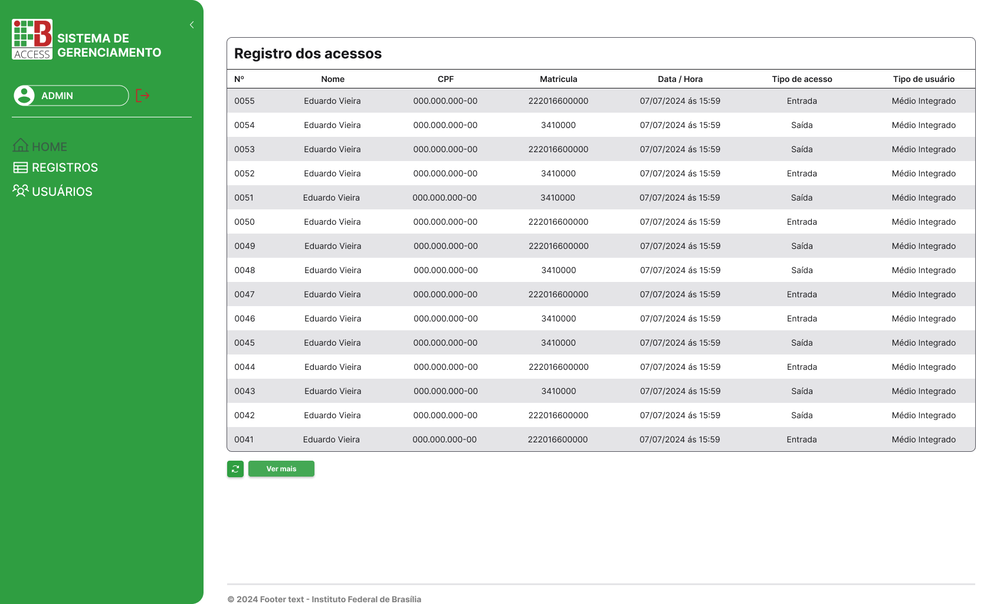

# 💻 IFB Access - Sistema de Gerenciamento de Acesso

  -brightgreen)
  &nbsp;&nbsp;
  

## 🎯 Sobre o Projeto

O **IFB Access** é um sistema web desenvolvido como Projeto de Conclusão de Curso para solucionar uma crítica falha de segurança no Instituto Federal de Brasília (IFB) Campus Brasília. Anteriormente, o controle de acesso era praticamente inexistente, com catracas eletrônicas subutilizadas e abertas, gerando vulnerabilidades para a comunidade acadêmica, que inclui estudantes menores de idade.

Este sistema nasceu para mitigar esses riscos, oferecendo uma interface administrativa robusta para a gestão centralizada de acessos. Através dele, a administração do campus pode gerenciar usuários, restringir o acesso apenas a pessoas autorizadas e auditar o fluxo de entradas e saídas em tempo real.

Atualmente, o projeto está em **fase piloto de implantação** no campus, em conjunto com uma solução de hardware (Arduino + NFC) desenvolvida por outra equipe, demonstrando sua aplicabilidade e impacto no mundo real.

---

## ✨ Funcionalidades Principais

- ✅ **Dashboard de Acessos:** Visualização em tempo real dos últimos registros de entrada e saída.
- 👤 **Gerenciamento de Usuários:**
  - Tabela completa com busca, paginação e filtros.
  - Cadastro de novos usuários (alunos, servidores, etc.).
  - Edição de perfis e permissões individuais.
  - Funcionalidade de bloquear/liberar o acesso de usuários específicos.
  - 📋 **Registros Detalhados:** Consulta e auditoria de todo o histórico de acessos, com informações detalhadas de data, hora e usuário.
  - 🔐 **Autenticação Segura:** Acesso restrito à plataforma apenas para administradores autorizados via Google OAuth, garantindo a segurança dos dados.
  - ➕ **Ações Manuais:** Permite adicionar registros de acesso manualmente para casos excepcionais.

---

## 🚀 Tecnologias Utilizadas

Este projeto foi construído com uma stack moderna, focada em performance, escalabilidade e uma ótima experiência de desenvolvimento.

### **Front-End:**

- [**React 18**](https://reactjs.org/) e [**Vite**](https://vitejs.dev/) para uma base rápida e reativa.
- [**TypeScript**](https://www.typescriptlang.org/) para tipagem estática e segurança no código.
- [**TailwindCSS**](https://tailwindcss.com/) para estilização ágil e consistente.
- [**Tanstack Query (React Query)**](https://tanstack.com/query/latest) para gerenciamento de estado de servidor e caching de requisições.
- [**React Hook Form**](https://react-hook-form.com/) + [**Zod**](https://zod.dev/) para validação de formulários robusta e schema-based.
- [**React Router DOM**](https://reactrouter.com/) para gerenciamento de rotas.
- [**Headless UI**](https://headlessui.com/) para componentes de UI acessíveis e desacoplados.
- [**Biome**](https://biomejs.dev/) como Linter e Formatador de código.

### **Back-End (API Consumida):**

- [**Python**](https://www.python.org/) com [**Flask**](https://flask.palletsprojects.com/) para a construção da API REST.
- [**MySQL**](https://www.mysql.com/) como banco de dados relacional.
- [**Docker**](https://www.docker.com/) para conteinerização e padronização do ambiente.

### **Design e Prototipação:**

- [**Figma**](https://www.figma.com/) para o design de todas as interfaces (UI) e prototipação da experiência do usuário (UX), com foco em acessibilidade.

---

## 🔒 Acesso e Demonstração

Por se tratar de um sistema em produção que manipula dados reais e sensíveis da instituição, o acesso à aplicação é restrito a administradores autorizados. Da mesma forma, a API consumida pelo sistema é privada, o que impede a execução do projeto em um ambiente local de forma independente.

No entanto, você pode explorar o projeto das seguintes maneiras:

1. 🎨 **Navegação pelo Protótipo no Figma:** Para entender o fluxo de telas e a experiência de usuário, você pode navegar pelo protótipo interativo [**neste link do Figma**](https://www.figma.com/design/h2xJaeMbgAyK7AmNMaASMi/SISTEMA-DE-GERENCIAMENTO?node-id=711-3076&t=URKIkJws3xKQMA5K-1).
2. 📄 **Documentação Completa (TCC):** Para uma análise aprofundada da arquitetura, regras de negócio, diagramas UML e decisões de projeto, você pode acessar o documento completo do Trabalho de Conclusão de Curso [**aqui**](https://drive.google.com/file/d/1I4WpQSBKHscXVN-tE9vuQD_y5p1S2qO0/view?usp=sharing).

---

## 👨‍💻 Minha Contribuição

Como desenvolvedor principal do front-end desta aplicação, minhas responsabilidades incluíram:

- Desenvolver toda a interface administrativa com React e TypeScript, desde a arquitetura de componentes até a integração com a API.
- Projetar e prototipar todas as telas no Figma, garantindo uma UI/UX intuitiva e acessível.
- Participar ativamente do desenvolvimento da API em Python/Flask, sendo responsável pela criação dos endpoints CRUD para usuários, registros e observações.

---

## 📝 Licença

Este projeto está sob a licença MIT.
